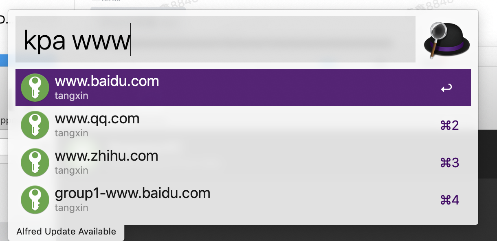
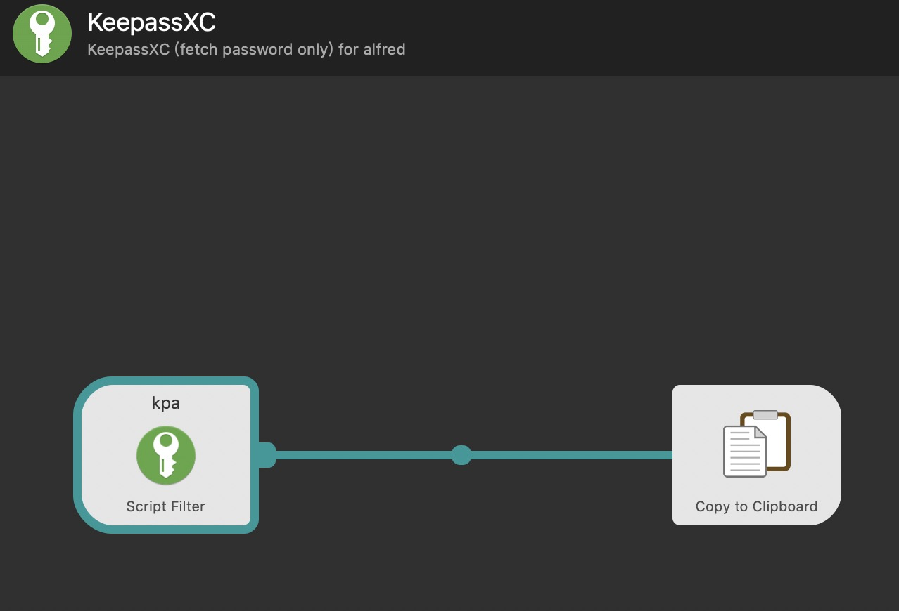

# alfred-keepassxc

> alfred-keepassxc 功能只有一个 **`查询 Title, 复制密码`**

## Todo

+ [x] `golang 1.12 下编译通过`
+ [x] 基础功能实现
+ [ ] 支持 key 认证

## Usage

在 `Alfred Workflows` 打开 `KeepassXC`,  双击 `Script Filter` 修改对应变量

`shell` 参考 [kpa.sh](kpa.sh)

